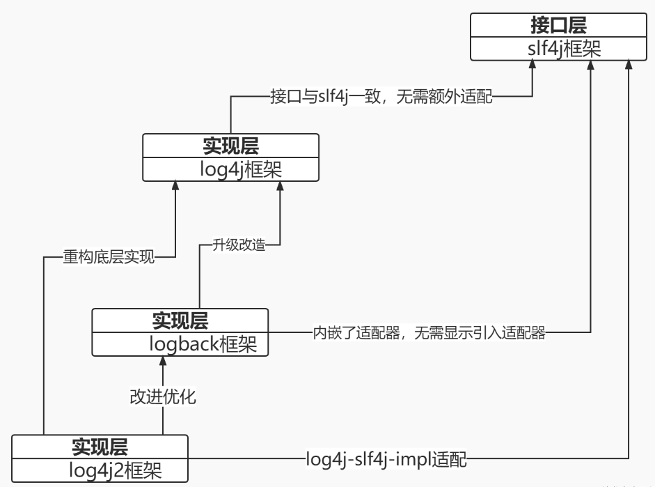

## 比较slf4j,log4j,log4j2,logback

###  时间线：log4j ->slf4j ->logback ->log4j2

###  [slf4j,log4j,log4j2,logback 关系与区别以及完整集成案例](https://blog.csdn.net/madness1010/article/details/128332275)

 

- SLF4J 是一个日志门面，它允许在不修改应用代码的情况下切换不同的日志实现。一般与具体的实现框架（如Logback或Log4j2）一起使用。

- Log4j 是一个功能强大而古老的日志框架，提供了许多高级功能。然而，由于其1.x版本存在一些问题，现在更推荐使用 Log4j2。

- Log4j2 是 Log4j 的升级版，解决了旧版本的一些问题，性能更好，并引入了新特性。在现代项目中，是一个不错的选择。

- Logback 是由 Log4j 的创始人开发的日志框架，旨在成为 Log4j 的继任者。它具有较好的性能和一些新特性，是一个流行的选择。
